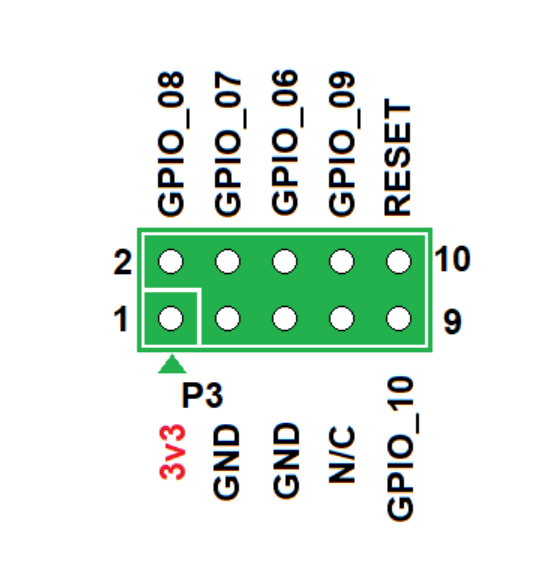

# MyQ SPI MX25L6433 Flash Reading

This guide covers a Macronix
MX25L6433-family 64-Mbit flash chip, read using a CH341A-compatible programmer.
The chip remained soldered to the board. Holding the **main MCU's RESETN
signal LOW by connecting it to GND** allowed successful in-circuit reading.

For the Home Assistant local-MQTT bridge, complete the reading and backup
steps, then extract your credentials. **No firmware modification or flash
write is required for that setup.** The optional writing section is for
separately researched experiments and recovery, not a HomeKit-enabling patch.
Apple Home support for the working local setup comes from HA's HomeKit Bridge.

## Before using this guide

| Detail | Publication status |
|---|---|
| Programmer model/revision | [CH341A Programmer](https://s.click.aliexpress.com/e/_c3ryCHgd) |
| Programming software | [AS Programmer](https://github.com/nofeletru/UsbAsp-flash) |
| Physical connection method | [Pogo Pins to SOIC-8](https://s.click.aliexpress.com/e/_c4qzONPF)|
| Board model | 050DCTWF https://www.chamberlain.com/receiver-logic-board-dc-wifi/p/050DCTWF |
| MCU RESETN connection | [P3 reset-point diagram, board backside](#p3-reset-point-board-backside) |
| Flash package | MX25L6433 |

The operation names below describe functions, not verified menu labels.
Replace them with exact buttons/screenshots once the software is confirmed.
The handoff reports `Current programmer: CH341`; it does not establish which
program or version performed the successful read.

## What you need

- The matching logic board and its identified flash chip.
- A CH341A-compatible programmer with verified 3.3-V SPI power and signals.
- The confirmed connection adapter or wiring for this board.
- A multimeter, an insulated RESETN-to-GND connection, and a computer.
- Programmer software supporting the exact flash device.
- Storage for several 8-MiB binary files and a separate backup location.

The chip capacity is **64 Mbit = 8 MiB = 8,388,608 bytes**. It is commonly
advertised as 8 MB. This guide's expected size does not apply to the separate
4-MiB images also present in the research workspace.

## 1. Disconnect normal power

1. Close the garage door normally before beginning, if possible.
2. Unplug the opener from mains power and disconnect its backup battery, if
   fitted. Switching it off through an app is not sufficient.
3. Photograph the board and cable connections before removing connectors.
4. Work only on the identified low-voltage logic-board connections. Do not
   touch the mains power-supply section; unplugging does not instantly
   discharge its capacitors.
5. Keep the CH341A unplugged from USB while attaching or changing wiring.

The procedure uses USB power source for programming. Ensure that the programmer
can handle powering the 3.3V rail by checking the active voltage and temperature.
If you feel overheating or if the voltage does not remain within 3.3V, the USB 
is not sufficient to power the rail. Do not simultaneously power the board normally
and from the programmer.

Some CH341A variants supply 3.3 V to the flash socket while driving SPI from
5-V circuitry. A multimeter supply check cannot verify the peaks of switching
data signals; use a documented compatible revision or have its levels checked
with suitable equipment. [Flashrom CH341A hardware notes](https://flashrom.org/supported_hw/supported_prog/ch341ab.html)

## 2. Identify the flash and connections

Read the complete chip marking, including its suffix. Find the package's
pin-1 indicator (dot/notch as defined for that package) and compare it with
the **top-view diagram for the exact package** in the
[Macronix datasheet](https://www.macronix.com/Lists/Datasheet/Attachments/9127/MX25L6433F%2C%203V%2C%2064Mb%2C%20v1.9.pdf).

Match signal names, not wire colors. Do not assume that an adapter's red wire
or socket orientation identifies the correct flash pin.

| Programmer connection | Flash/board signal | Purpose |
|---|---|---|
| GND | GND | Shared electrical reference |
| Verified 3.3-V supply | VCC | Flash power |
| CS / CS# | CS# | Selects the flash chip |
| CLK / SCLK | SCLK | Clock |
| MOSI | SI / DI / SIO0 | Data from programmer to flash |
| MISO | SO / DO / SIO1 | Data from flash to programmer |
| Board's verified pull-up arrangement | WP# | Keep inactive/HIGH for ordinary SPI operations |
| Board's verified pull-up arrangement | HOLD# | Keep inactive/HIGH for ordinary SPI operations |
| GND through the confirmed reset connection | Main MCU RESETN | Keeps the MCU from interfering with SPI access |


**MCU RESETN is a separate board signal. Do not substitute the flash chip's
HOLD# pin or an unrelated reset point.**

## 3. Connect the board with MCU reset asserted

The connection chain is:

```text
Computer USB port
       |
CH341A programmer (verified 3.3-V supply AND SPI signals)
       |
25-series SPI socket adapter or labeled SPI header
       |
Pogo-probe cable and spring-loaded contacts
       |
Flash chip leads on the unpowered opener logic board

Programmer GND -------- board GND
                           |
                    confirmed MCU RESETN
                    (separate jumper)
```

The pogo probe is a temporary electrical connection, not a programmer. Its
spring-loaded tips contact the chip's metal leads or verified connected pads;
pressing them against the plastic chip body will not make a connection.
The chip stays soldered to the board.

The listed accessories are a [pogo-pin SOIC-8 probe](https://s.click.aliexpress.com/e/_c4qzONPF)
and a [CH341 programmer](https://s.click.aliexpress.com/e/_c2zX0BnL).
Verify your actual probe's footprint and programmer revision before use.

### Flash pin orientation and wiring

For the **MX25L6433F in the 8-pin SOP package**, the top view is below. Look
down at the chip marking, with its pin-1 indicator at the upper left. This is
not the view looking into the underside of the pogo probe.

```text
                   TOP VIEW
                +------------+
       CS#   1 -| o        8 |- VCC
   SO/MISO   2 -|          7 |- HOLD#/SIO3
  WP#/SIO2   3 -|          6 |- SCLK
       GND   4 -|          5 |- SI/MOSI
                +------------+
```

| Flash pin | Flash signal | Programmer/probe connection |
|---:|---|---|
| 1 | CS# | SPI CS / CS# |
| 2 | SO / SIO1 | MISO / DO |
| 3 | WP# / SIO2 | Verified inactive HIGH arrangement described below |
| 4 | GND | GND; also common with board ground |
| 5 | SI / SIO0 | MOSI / DI |
| 6 | SCLK | CLK / SCK |
| 7 | HOLD# / SIO3 | Verified inactive HIGH arrangement described below |
| 8 | VCC | Verified 3.3-V supply |

Pin numbers and signal functions come from page 7 of the
[Macronix MX25L6433F datasheet](https://www.macronix.com/Lists/Datasheet/Attachments/9127/MX25L6433F%2C%203V%2C%2064Mb%2C%20v1.9.pdf).
Other packages require their own pin diagram. Follow MOSI/MISO direction if
your programmer uses ambiguous DI/DO labels.

### Connect everything before plugging in USB

1. **Leave all power disconnected.** Disconnect mains and the backup battery,
   and keep the CH341A unplugged from the computer. Place the logic board on
   a nonconductive surface.
2. **Connect the probe cable to the programmer.** If your kit has an 8-pin
   plug or adapter board, put it in the programmer's documented **25-series
   SPI** socket position, align pin 1, and close the ZIF socket lever. Do not
   use the 24-series I2C position. If using individual wires, connect them to
   the labeled SPI header according to the table. Socket placement and header
   pin numbers vary by revision; do not assume pin 1 is nearest the USB plug.
3. **Check the cable mapping with a multimeter.** With power still off, use
   continuity mode to trace each programmer signal through the adapter and
   cable to its intended pogo tip. Confirm the probe's pin-1 tip; a red wire
   alone is not proof of orientation. Check for wiring shorts, especially
   between VCC and GND.
4. **Arrange WP# and HOLD# correctly.** For this ordinary SPI procedure,
   keep flash pins 3 and 7 HIGH using the verified board/adapter pull-ups to
   3.3 V. An eight-contact probe reaches these pins too, so inspect how its
   adapter drives them. Do not blindly strap board-connected signals directly
   to VCC, connect them to 5 V, or ground HOLD# to reset the MCU. The board's
   pull-up arrangement must be established before applying power.
5. **Hold the main MCU in reset.** Connect the separately confirmed MCU
   RESETN point to board GND with an insulated jumper. Board GND and programmer
   GND must be common. Refer to the [P3 diagram below](#p3-reset-point-board-backside)
   for the supplied board-backside orientation. Match the P3 pin-1 marker on
   your board before identifying the reset and ground contacts.
6. **Seat and secure the pogo probe.** Align its verified pin-1 contact with
   flash pin 1. Keep the probe square so every tip touches only its intended
   lead or pad. Use steady, light pressure and a suitable holder so the tips
   cannot slide across neighboring leads during a read. Check the contacts
   and wiring once more with USB disconnected.
7. **Connect the programmer to the computer last.** Plug its USB connector
   into the computer, using a data-capable extension or adapter if needed to
   avoid pulling on the probe. USB now powers the programmer and the target
   flash through VCC; keep the opener's normal power disconnected. Use the
   driver appropriate to your programmer and AS Programmer, and confirm the
   device appears in Windows Device Manager.
8. **Check power before reading.** Measure flash VCC relative to GND and
   confirm it is approximately 3.3 V; confirm MCU RESETN stays LOW. Supply
   voltage alone does not prove safe SPI signal levels: some CH341A boards
   power their socket at 3.3 V but drive signals at 5 V. Use the verified
   revision required in step 1. See the
   [flashrom CH341A hardware notes](https://www.flashrom.org/supported_hw/supported_prog/ch341ab.html).
   Keep the probe and reset jumper stable, then continue to step 4 to identify
   the chip and read it.

**Unplug USB before moving the probe, changing any wire, or removing the reset
jumper.** If a contact slips, disconnect USB and reseat it before trying again.

### P3 reset point (board backside)



In this supplied diagram, **P3 pin 10 is labeled RESET**, and **pins 3 and 5
are labeled GND**. Pin 1 is the lower-left contact marked by the triangle;
it is labeled **3V3**, not ground. The upper row contains even-numbered pins
2 through 10, and the lower row contains odd-numbered pins 1 through 9.

For the matching board and orientation, connect RESET (pin 10) to either
identified GND contact (pin 3 or 5) to hold the MCU in reset. Connect programmer
GND to the same board ground. Attach the jumper with all power disconnected,
and keep it in place while reading. This is a pinout diagram rather than a
board photograph; verify the header and orientation on your actual board.

The flash's VCC may also power other parts of the board through shared traces.
Watch for hot components, repeated USB disconnects, supply
voltage collapse, or excessive current. If any occurs, unplug USB and
investigate the power arrangement. Do not compensate by raising the voltage
or reconnecting normal opener power. In-circuit back-powering and bus
interference are known limitations. 
## 4. Identify the chip in software

Keep the pogo probe and reset jumper in place while identifying the chip.
**Use only identification and read operations. Do not select Erase, Write,
Program, or an automatic erase/program operation.**

1. Install and open [AS Programmer](https://github.com/nofeletru/UsbAsp-flash).
2. Select the CH341-compatible programmer and the **SPI** interface.
3. Run the chip-identification operation, typically labeled **Read ID**,
   **Detect**, or **Identify**. Exact labels depend on the software version.
4. Compare the detected device with the complete marking on the flash chip,
   including its suffix. Select the matching Macronix MX25L6433-family entry.
   If the exact device is unavailable, use an alternative only when its
   compatibility is documented; matching capacity alone is insufficient.
5. Confirm the selected capacity is **8 MiB (8,388,608 bytes)** for the
   64-Mbit chip covered by this guide. Continue to step 5 only after the chip
   is identified successfully.

### If identification fails

Unsuccessful reads during this project returned `ID(9F): FFFFFF`. This is not
a successful device identification. Possible causes include poor pogo contact,
incorrect wiring, missing power, or interference from the main MCU.

Unplug USB before adjusting the probe or wiring. Recheck pin-1 orientation,
the signal mapping, and the shared ground connection. After securing the
connections and reconnecting USB, verify the flash's 3.3-V supply and confirm
that the MCU RESETN point remains LOW. Then retry identification.

## 5. Read the entire flash three times

**Do not press erase or write on the AS Programmer!!!**

1. Choose **Read** for the entire chip. Wait until it finishes without errors.
2. Save the buffer as a raw binary file named `myq-original-read1.bin`.
3. Choose **Read** again and save the newly read buffer as
   `myq-original-read2.bin`.
4. Repeat once more and save `myq-original-read3.bin`.

Three separate reads are preferred; at least two must match. Saving one
buffer under multiple filenames does not test read reliability.

Do not select Erase, Write, Program, or an automatic erase/program operation.
Keep the physical connections and RESETN stable while each read runs.

## 7. Check size and compare the reads on Windows

Put all three files in one folder. In File Explorer, open that folder, type
`powershell` in the address bar, and press Enter. Run:

```powershell
Get-Item .\myq-original-read1.bin, .\myq-original-read2.bin, .\myq-original-read3.bin | Select-Object Name, Length
Get-FileHash .\myq-original-read1.bin, .\myq-original-read2.bin, .\myq-original-read3.bin -Algorithm SHA256
```

Every Length must be **8388608**. Every Hash must match exactly. A hash is a
fingerprint of the complete file: different hashes mean different contents.
If the files differ, return to the connection checks; do not choose one at
random or proceed to writing.

Matching files can still be repeated failed reads. Check that the programmer
identified the chip correctly and that the saved buffer contains varied data,
not only `FF` or `00`. Those values can legitimately fill unused portions,
but should not fill this entire firmware image. Parsing the image with the
project's firmware tools provides another check.

## 8. Preserve an untouched backup

Create this folder structure and copy a verified read to `originals`:

```text
myq-flash/
    originals/
        myq-original.bin
    hashes.txt
```

Keep all original reads. Copy the verified backup to a second private storage
location and record its SHA-256 hash in `hashes.txt`. Never edit the only
original. Dumps contain device secrets and may contain Wi-Fi passwords


For local MQTT setup, unplug USB, remove the programming connections, release
RESETN, and restore the board's normal wiring before restoring power. Continue
with credential extraction and the HAOS installation instructions.

## 9. Extract the serial and unwrapped PSK for local MQTT

With Python installed and the full project downloaded, open PowerShell in the
project folder. Place a working copy of your verified dump there as
`myq-original.bin`. These commands read the file and do not alter it:

```powershell
python analysis/psmtool.py myq-original.bin --name myq_sn --show-values
python analysis/psmtool.py myq-original.bin --name myq_aes --unwrap-myq-aes
```

For the serial, use the ten-character `value_ascii` from the active `myq_sn`
record. For the PSK, use the **32 hexadecimal characters after
`unwrapped_hex=`**. Do not use the wrapped `myq_aes` bytes or your Wi-Fi password.

The tool needs `analysis/fwtool.py` beside it and supports the layouts studied
in this project; errors or missing records need investigation, not guessed
offsets. A successful unwrap is not by itself a live authentication test.
The door's six-byte device ID is a separate value; these two commands do not
extract it. Obtain it from decrypted MITM traffic as described in step 10.

## 10. Obtain the device ID from decrypted MITM traffic

**For the procedure documented in this project, you must obtain `device_id`
from a man-in-the-middle (MITM) capture of your opener's MQTT traffic.** The
flash extraction commands above provide the serial and PSK, not the device ID.
This repository does not currently establish a flash-only device-ID extraction
method.

The capture must already be decrypted so Wireshark can display **MQTT**.
An encrypted TLS capture alone does not expose the device ID. MITM positioning
alone does not decrypt TLS either: your capture/decryption setup must provide
the plaintext MQTT messages. The steps below cover extracting the ID from that
decrypted traffic; configuring the MITM capture and Wireshark TLS decryption
is a separate prerequisite.

1. Open your decrypted capture in Wireshark and apply this display filter,
   replacing `<serial>` with your opener's ten-character myQ serial:

   ```text
   mqtt.topic == "S/0F/<serial>/011/0000"
   ```

2. Select a matching **MQTT PUBLISH** packet carrying a door-state message.
3. In Packet Details, expand **MQ Telemetry Transport Protocol**, then select
   **Message** to highlight the MQTT payload bytes. Wireshark identifies the
   topic as `mqtt.topic` and the binary message as `mqtt.msg`; see its
   [MQTT field reference](https://www.wireshark.org/docs/dfref/m/mqtt.html).
4. Take the **first six bytes of the MQTT payload**, excluding the MQTT headers,
   topic, and any TLS/TCP framing. The observed door-state payload is 12 bytes.
5. Remove spaces from those six bytes, preserving their original order. Enter
   the resulting twelve hexadecimal characters as `device_id` in the app.
6. Check several door-state packets from the same opener. Their first six
   bytes should agree before you use the value.

For example, this **synthetic** door-state payload:

```text
11 22 33 44 55 66 | 81 00 42 60 | 02 00
<-- device ID -->
```

would produce:

```yaml
device_id: "112233445566"
```

Extract your own value; do not copy the example, reverse its byte order, or
substitute your myQ serial. If the filter returns no packets and Wireshark
still shows only TLS application data, resolve capture decryption first.

The repository also provides [decrypt_tls_psk_pcap.py](analysis/decrypt_tls_psk_pcap.py)
to decode supported TLS-PSK captures with the recovered PSK. It prints decoded
MQTT messages; it does not automatically configure Wireshark or export a
decrypted capture for these GUI steps. See [WRITEUP.md](WRITEUP.md) for usage.

Once you have the serial, unwrapped PSK, and device ID, continue with the
[HAOS installation instructions](myq_local/README.md).
