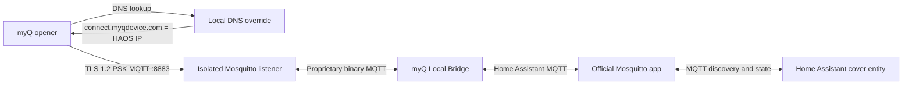

# Reverse Engineering a Chamberlain/myQ Opener for Local MQTT Control

Research date: 2026-09-08

This writeup describes the examined flash images, captured protocol behavior,
and the local Home Assistant bridge built from those findings. For installation
and configuration, see the [README](README.md) and [app setup guide](myq_local/README.md).

## Executive summary

- The device is built around a Marvell 88MW30x-class Cortex-M4F application
  environment with Marvell `WMPT` partitions and `MRVL` firmware containers.
- The original 8 MiB flash image contains two A/B application slots. The two
  separately read original images are byte-for-byte identical, confirming a
  stable read.
- A separate image, referred to here as `read.bin`, uses a 4 MiB layout.
  Its myQ Wi-Fi/ARM module reports version **3.13**.
- The cloud connection is MQTT 3.1.1 over TLS 1.2 on TCP port 8883. The observed
  cipher is `TLS_PSK_WITH_AES_128_CBC_SHA` (`0x008C`) with RFC 7366
  Encrypt-then-MAC.
- The TLS PSK identity is the opener's ten-byte myQ serial. The PSK is a
  device-specific 16-byte value stored in external flash as `psm_seed/myq_aes`.
  Firmware unwraps it with a compiled-in TEA-family routine before passing it to
  Mbed TLS.
- Successful decryption of captured sessions, including valid record HMACs and
  CBC padding, cryptographically confirms the recovered value is the actual TLS
  PSK.
- Most MQTT payloads are compact binary structures, not a second encrypted
  layer. Door command and state layouts were identified by correlating traffic
  with three physical open/close cycles.
- The opener uses a locally reachable DNS resolver for
  `connect.myqdevice.com`. Firmware also includes a public-resolver fallback,
  so a robust local deployment should restrict or redirect outbound DNS.
- The firmware contains a HomeKit stack and an Apple/MFi hardware-authentication
  driver. Static analysis proves support, but does not prove that an MFi
  authentication coprocessor is physically populated.
- A local HAOS app now terminates the legacy TLS-PSK connection, translates the
  proprietary MQTT messages, and exposes a native Home Assistant garage-door
  cover. The current app version, **0.1.3**, requires users to enter their own
  credentials and includes the startup response required by firmware 3.13.

### Scope and source material

The analysis covers an original 8 MiB flash layout and the separate 4 MiB
`read.bin` layout. These names identify research inputs, not files shipped in
this repository. Firmware offsets and runtime addresses are specific to the
examined images and should not be assumed to apply to every myQ model.

Related reference dumps are available in the
[MyQ ESP Transplant project's MX25L6433 directory](https://github.com/fuxxociety/MyQ-ESP-transplant/tree/main/FlashROM%20dumps/MX25L6433/orig).
Device-specific flash images and packet captures used for this investigation
are not included here.

## Firmware organization

### Original 8 MiB image

The original image has redundant `WMPT` partition tables at `0x004000` and
`0x005000`; generation 5 is newer. Important regions are:

| Flash range | Partition | Purpose |
|---|---|---|
| `0x000000-0x003FFF` | `boot2` | Boot and control data |
| `0x006000-0x00BFFF` | `ed_data` | Radio/device calibration-style data |
| `0x00C000-0x05BFFF` | `wififw` | Separate WLAN firmware |
| `0x05C000-0x0BFFFF` | `ftfs` | Marvell web filesystem and provisioning assets |
| `0x0C0000-0x29FFFF` | `mcufw` generation 6 | Application slot A |
| `0x2C8000-0x2CFFFF` | `mfg` | Manufacturing and HomeKit-related records |
| `0x2D0000-0x2FFFFF` | `psm` | Network/system configuration and history |
| `0x300000-0x303FFF` | `psm_seed` | MAC, myQ serial, and wrapped TLS PSK |
| `0x304000-0x305FFF` | `psm_bl` | Bootloader-key history |
| `0x306000-0x30DFFF` | `psm_tls` | Persisted TLS RNG material, not the PSK |
| `0x30E000-0x311FFF` | `psm_cert` | Erased in the examined image |
| `0x322000-0x329FFF` | `psm_hk` | HomeKit firmware/config history |
| `0x342000-0x521FFF` | `mcufw` generation 7 | Application slot B |
| `0x522000-0x7FFFFF` | `fwupdate` | Update staging |

The two application slots share the same architecture and entry point but are
not identical builds. Slot B is larger and has the newer partition generation.
Its container timestamp decodes to 2021-07-10 19:19:36 UTC; slot A's timestamp
is zero. This supports an A/B update design, although the dump alone does not
prove which slot was executing when power was removed.

### MCU image mapping

The first `MRVL` image begins at flash `0x0C0000`, has three declared segments,
and enters at `0x1F0028B1`:

| Segment | Flash offset | Size | Runtime address |
|---:|---:|---:|---:|
| 0 | `0x0C00C8` | `0x27E8` | `0x00100000` |
| 1 | `0x0C28B0` | `0x84838` | `0x1F0028B0` |
| 2 | `0x1470E8` | `0x1D24` | `0x20000040` |

The odd entry address, vector table, valid Cortex-M stack pointer, and clean
Thumb-2 disassembly establish little-endian ARM M-profile code. Repository
documentation identifies the application core as Cortex-M4F.

For slot A's XIP segment:

```text
flash   = runtime - 0x1EF40000
runtime = flash   + 0x1EF40000
```

### `read.bin` layout and version

`read.bin` uses a compact 4 MiB partition map with application slots at
`0x082000` and `0x348000`. Both contained `MRVL` images are byte-identical and
enter at `0x1F0028B1`. Its active HomeKit record contains `hk.fwver = 3.13`,
and code around `0x1F051012-0x1F051028` constructs the same `3.13` value for
the `arm_fw_rev` status field. This is the myQ Wi-Fi/ARM module firmware
revision.

The main garage-opener controller has a separate `fw_rev`. Firmware obtains
that value over the internal Saturn/PIC communication link at runtime and
formats it as `major.minor`; a cold SPI dump does not preserve that runtime
value. Strings such as `WMSDK_4.0`, `V6.1.r8.p1`, and GCC `4.9.3` identify
components or toolchains, not the myQ product firmware revision.

## Persistent storage and sensitive data

The persistent store is Marvell PSMv2, an append-only name/value store. The
observed record layout is:

| Offset | Size | Meaning |
|---:|---:|---|
| `+0x00` | 2 | Magic `55 AA` |
| `+0x02` | 1 | State (`FF` active, `FE` obsolete) |
| `+0x03` | 4 | CRC field |
| `+0x07` | 2 | Value length, little-endian |
| `+0x09` | 2 | Object ID, little-endian |
| `+0x0B` | 1 | Name length |
| `+0x0C` | variable | Name followed immediately by value |

Deleting or replacing a value does not necessarily erase its older record.
That matters for forensic and privacy analysis.

### Data present in the original dump

The original main PSM contains both active and obsolete plaintext Wi-Fi
credentials:

| Record | Value offset | Stored length | Encoding |
|---|---:|---:|---|
| Active SSID | `0x002D018A` | 8 | Printable ASCII |
| Obsolete SSID | `0x002D006A` | 32 | Printable ASCII |
| Active passphrase | `0x002D0213` | 27 | Printable ASCII |
| Obsolete passphrase | `0x002D010B` | 11 | Printable ASCII |

Values are deliberately omitted. The obsolete records show why a logical
factory reset or credential replacement is not equivalent to securely erasing
the flash.

### Data present in `read.bin`

`read.bin` contains:

- A plaintext Wi-Fi SSID and passphrase.
- Network BSSID, security mode, channel, and device/system name.
- A six-byte MAC address.
- `psm_seed/myq_sn`: the ten-byte myQ serial and TLS-PSK identity.
- `psm_seed/myq_aes`: a wrapped 16-byte device TLS PSK.
- Manufacturing/HomeKit records containing a salt, 384-byte SRP verifier,
  plaintext setup code, and timestamp.
- A bootloader-related `bl.key` record.
- HomeKit configuration and firmware-version history.

In this image, `psm_tls`, `psm_cert`, and `psm_log` contain no parsed active
records. No active `sw_uuid` or `sw_token` record was identified. Empty TLS or
certificate partitions do not make the dump safe: the recoverable TLS PSK,
Wi-Fi password, HomeKit setup material, and device identifiers remain
sensitive.

## Tracing the TLS PSK

### The Mbed TLS call

The first application image contains a wrapper at `0x1F0537F0`. Immediately
before the call at `0x1F053838`, the firmware sets all five ARM EABI arguments
for the function identified as `mbedtls_ssl_conf_psk`:

```asm
1F05382C  movs   r3, #0x0A
1F05382E  str    r3, [sp]      ; identity length = 10
1F053830  mov    r1, r8        ; PSK pointer
1F053832  mov    r0, r6        ; mbedtls_ssl_config pointer
1F053834  movs   r2, #0x10     ; PSK length = 16
1F053836  mov    r3, r7        ; identity pointer
1F053838  bl     0x1F03E66C    ; mbedtls_ssl_conf_psk
```

The callee validates and copies the PSK and identity into the Mbed TLS
configuration object, matching the classic five-argument Mbed TLS 2.x API.
This establishes a 16-byte PSK and ten-byte identity independently of packet
capture interpretation.

### Identity source

The identity data flow is:

```text
psm_seed/myq_sn
  -> device record at 0x001228DA
  -> connection identity at 0x001232D8
  -> TLS connection object
  -> R3 at 0x1F053838, length 10 on the stack
```

The active value is a ten-character myQ serial. Captured ClientKeyExchange
messages expose the same identity in plaintext, as expected for this TLS-PSK
mode.

### PSK source and wrapping

The PSK data flow is:

```text
psm_seed/myq_aes (16 wrapped bytes)
  -> PSM getter at 0x1F04D454
  -> read/unwrap path at 0x1F04D4B4
  -> two-block unwrap at 0x1F06D17C
  -> connection PSK at 0x0012330E
  -> TLS connection object
  -> R1 at 0x1F053838, length 16 in R2
```

Despite the PSM object name `myq_aes`, the flash wrapper is not AES. It is a
two-block, 32-round TEA-family construction using a 16-byte constant compiled
into the application. The local [PSM tool](analysis/psmtool.py) reproduces both the
unwrap and inverse wrap and checks the round trip.

The resulting plaintext is the TLS PSK. It is not derived from the serial or
MAC address. Firmware also contains provisioning paths capable of writing the
wrapped value through a factory CLI or Saturn/UART message flow. Once
provisioned, the normal TLS connection reads the value from external flash; it
does not need to fetch it live from the other opener MCU.

## Verification on the wire

The captured ClientHello offers only two suites:

| ID | Cipher suite | Role |
|---:|---|---|
| `0x0004` | `TLS_RSA_WITH_RC4_128_MD5` | Legacy certificate-based alternative |
| `0x008C` | `TLS_PSK_WITH_AES_128_CBC_SHA` | Observed and supported PSK path |

The cloud server selects `0x008C` with TLS 1.2 and RFC 7366
Encrypt-then-MAC. Using the recovered per-device PSK to derive the TLS master
secret produces valid HMAC-SHA1 values and CBC padding for every protected
record in the complete sessions. This is substantially stronger evidence than
finding a plausible 16-byte value in flash.

The PSK is input keying material, not the final AES-CBC session key. TLS derives
fresh client/server encryption and MAC keys from the PSK plus both handshake
randoms. A local server therefore needs the exact identity-to-PSK mapping; an
arbitrary 16-byte key cannot authenticate the device.

The RSA/RC4 alternative is obsolete, generally disabled by modern TLS
libraries, and was not used in the captures. It should not be used for local
control.

### Certificates and pinning

The selected pure-PSK suite does not exchange an X.509 server certificate.
Consequently, the observed cloud path has no server certificate to pin. The
server proves possession of the shared PSK instead. A Mosquitto `psk_hint` is
only an identity hint; it is not a certificate.

Certificate parser and private-key functions exist in the firmware because the
TLS library and other services support certificate modes. Their presence does
not prove a complete credential is embedded. The erased `psm_cert` partition
is consistent with the observed PSK transport.

## MQTT and application protocol

After TLS decryption, the connection is MQTT 3.1.1 with a 360-second keepalive.
The client ID and PSK identity are the myQ serial. Topic direction is
consistent:

```text
G/<serial>/...       cloud/local broker -> opener
S/0F/<serial>/...    opener -> cloud/local broker
```

The opener subscribes to its `G/<serial>/#` tree. Most payloads are short
fixed-layout or field/length/value structures; they are not encrypted again
after TLS.

### Door command

The observed door-control topic is:

```text
G/<serial>/011/0000
```

The 12-byte payload is:

```text
<six-byte door ID> | 80 02 00 01 | <little-endian action>
```

Observed actions are:

| Final two bytes | Meaning |
|---|---|
| `01 00` | Open |
| `00 00` | Close |

### Door state

The corresponding state topic is:

```text
S/0F/<serial>/011/0000
```

The last little-endian value maps as follows:

| Value | State | Confidence |
|---:|---|---|
| 1 | Open | Observed |
| 2 | Closed | Observed |
| 3 | Stopped | Inferred, not observed |
| 4 | Opening | Observed |
| 5 | Closing | Observed |

Three complete cycles showed a consistent delay of approximately nine seconds between a
remote close command and the `Closing` state, likely the opener's warning
interval. Topic `019/0005` echoed the requested action, and `019/0025`
contained two equal 32-bit values that incremented after each completed close,
strongly suggesting a cycle counter.

### Startup response

One 32-byte server payload on `G/<serial>/012/0040` appeared high-entropy. Static tracing
showed its handler tail-calls a no-op function at `0x1F054FF4`; this firmware
does not decrypt, compare, or retain that payload. Its server-side meaning
remains unknown. A subsequent investigation of repeated local disconnects
showed that the outer MQTT state machine nevertheless requires a server
PUBLISH within 12 seconds. Receiving the startup publish satisfies that
connection check. App version 0.1.2 sends a fresh 32-byte, non-retained reply
on this topic when the opener sends an empty, non-retained startup announcement
on `S/0F/<serial>/003/0000`.

The observed MQTT traffic uses QoS 0. Commands sent while the opener is offline
are therefore lost, and retained door commands would be unsafe.

## DNS behavior

Traffic captures taken during the investigation showed the opener sending ordinary DNS
queries for `connect.myqdevice.com` to the local gateway/resolver rather than a
fixed public address.

Static configuration supports that observation:

- `read.bin` stores `network.lan = DYNAMIC`.
- It has no active `network.dns1` or `network.dns2` PSM value.
- The Marvell network structure supports DHCP-supplied DNS and states that DHCP
  overwrites the IP, gateway, netmask, and DNS fields.
- The application also contains a public DNS address that appears to be a
  default or fallback.

The evidence therefore supports DHCP/local DNS operation with a possible
fallback. A robust local deployment is:

1. Provide the desired resolver through DHCP option 6.
2. Override `connect.myqdevice.com` to the HAOS host address.
3. Permit the opener to use only that DNS resolver, or redirect its outbound
   TCP/UDP port 53 traffic to it.
4. Block direct outbound TCP 8883 during testing so failure cannot silently
   fall back to the cloud service.
5. With the local bridge running and the rewrite active, enter Wi-Fi setup
   mode, join the opener's `MyQ-...` network, and configure Wi-Fi through
   **http://setup.myqdevice.com/** in a browser instead of the myQ phone app.
   Verify both the DNS query and the connection to the local host; a
   power-cycle alone may not cause a fresh DNS lookup.

## HomeKit and MFi findings

`read.bin` includes HomeKit Accessory Protocol logic, pairing strings,
HomeKit version records, and a driver matching the Apple authentication
coprocessor workflow. Relevant runtime locations include:

| Address | Behavior |
|---:|---|
| `0x1F0324C4` | Reads certificate length/data registers `0x30/0x31` |
| `0x1F0325FC` | Reads authentication control/status register `0x10` |
| `0x1F032620` | Reads response length/data registers `0x11/0x12` |
| `0x1F0326F8` | Initializes I2C and selects seven-bit address `0x10` or `0x11` |
| `0x1F055724` | HomeKit initialization gate |

Firmware strings include:

```text
MFI Hardware Initialization failed!
[hk] Auth check = %s
[hk] Auth chip Info: ProtoV %d.%d DevV %d, FwV %d, DevID %d.%d.%d.%d
```

The firmware supports communication with an MFi authentication coprocessor over
I2C. No MFi coprocessor was identified on the examined myQ logic board. The
presence of this firmware code alone does not establish hardware availability
or working HomeKit support on other boards.

## Local-control architecture

The local design terminates the protocol expected by the opener and translates
it to ordinary Home Assistant MQTT discovery:



The device-facing listener is configured with:

```text
TLS version:  TLS 1.2
Cipher:       PSK-AES128-CBC-SHA
PSK identity: opener-specific ten-character serial
PSK:          opener-specific 16-byte value, entered as 32 hexadecimal digits
Port:         8883/tcp
```

The bridge maintains separate clients for the isolated device broker and the
official Home Assistant MQTT service. It publishes retained availability and
state, but never retains door commands. It refuses `OPEN` or `CLOSE` when the
physical opener is offline.

The code is reusable, but the credentials are per device. Supporting several
openers requires an identity-to-PSK mapping and separate serial/device-ID
configuration for each opener.

## HAOS application

The HAOS application lives in [`myq_local/`](myq_local/) and supports `amd64`
and `aarch64`. Its [manifest](myq_local/config.yaml) requires device-specific
credentials rather than supplying defaults:

```yaml
options:
  serial: null
  device_id: null
  psk: null
  name: "Garage Door"
  discovery_prefix: "homeassistant"
schema:
  serial: str
  device_id: str
  psk: password
  name: str
  discovery_prefix: str
```

The `null` defaults plus non-optional schema fields make the three device
values mandatory before startup. The `password` type masks the PSK in the
Home Assistant interface. Startup code validates exact lengths and hexadecimal
encoding, writes a temporary Mosquitto PSK file under `/run` with mode `0600`,
and does not print the secret.

Install from the app directory using the [setup guide](myq_local/README.md).
Version 0.1.1 removed device-specific defaults; version 0.1.2 added the startup
response described above. See the [changelog](myq_local/CHANGELOG.md) for details.

### Validation scope

The investigation recorded three physical open/close cycles and successful
decryption of captured TLS sessions with valid record MACs and CBC padding.
The repository now includes regression tests and an isolated two-broker runtime
test using synthetic credentials. They cover command handling, MQTT discovery,
TLS-PSK authentication, and telemetry recovery after an MQTT broker restart.
See [BUILDING.md](BUILDING.md) for commands and the tested dependency set.

These findings apply to the examined device and firmware. They do not establish
compatibility with all myQ or Security 2.0+ openers. The bridge implements open
and close commands; stop commands and position control are not implemented.

### HAOS installation and test

1. Install and start Home Assistant's official Mosquitto Broker app.
2. Add the MQTT integration under **Settings > Devices & services**.
3. Clear the official broker app's host mapping for port 8883 so the myQ app
   can own that port. Leave its normal MQTT service enabled.
4. Copy `myq_local/` to `/addons/myq_local` on HAOS, check for updates in the
   app store, and install **myQ Local Bridge** from Local apps. Enter the
   opener-specific serial, six-byte door ID, and 32-hex-digit PSK in its
   Configuration tab.
5. Start the app. Its initial log should show the isolated PSK broker and Home
   Assistant discovery bridge starting successfully.
6. **Apply the DNS override before configuring Wi-Fi.** The opener's DNS
   resolver must answer `connect.myqdevice.com` with the HAOS host IP.
7. **Use the browser setup URL instead of the myQ phone app.** Put the opener
   in Wi-Fi setup mode, connect to its `MyQ-...` network, and open
   **http://setup.myqdevice.com/**. Select **Change Wi-Fi Settings**, enter the
   home network credentials, and select **Next** after saving to connect.
   Use **Erase Wi-Fi Settings** first if needed. If the setup hostname fails,
   use the gateway IP shown for the `MyQ-...` connection in an HTTP URL.
8. Confirm a TLS client connection followed by a decoded door state.
9. Verify `myq_local/+/availability`, `myq_local/+/state`, and
   `myq_local/+/attributes` through Home Assistant's MQTT topic listener before
   attempting movement.

Only after the read-only path succeeds should a supervised command be tested.
Use Home Assistant's cover entity or publish `OPEN`/`CLOSE` to
`myq_local/<serial>/command` with retain disabled.

## Reproduction tools

The local analysis utilities read existing flash images and packet captures;
they do not acquire a flash image from the physical device.

| Tool | Purpose |
|---|---|
| [`fwtool.py`](analysis/fwtool.py) | Parse `WMPT`/`MRVL`, map segments, hash regions, compare slots |
| [`psmtool.py`](analysis/psmtool.py) | Parse PSMv2 and reproduce the device-key unwrap |
| [`thumbxref.py`](analysis/thumbxref.py) | Thumb-2 disassembly and literal/call cross-references |
| [`decrypt_tls_psk_pcap.py`](analysis/decrypt_tls_psk_pcap.py) | Reassemble TCP, derive TLS 1.2 PSK keys, validate records, and decode MQTT |

`fwtool.py` and `psmtool.py` use the Python standard library. Disassembly requires
`capstone`; capture decryption requires `dpkt` and `pycryptodome`. Install the
optional dependencies in your Python environment:

```powershell
python -m pip install capstone dpkt pycryptodome
```

Run these examples from the repository root. Replace `flash.bin` and
`capture.pcap` with your own files, and replace the PSK placeholder with your
device's unwrapped key:

```powershell
python analysis/fwtool.py flash.bin --summary --compare --partition-stats
python analysis/psmtool.py flash.bin --partition psm_seed --name myq_sn --show-values
python analysis/psmtool.py flash.bin --partition psm_seed --name myq_aes --unwrap-myq-aes
python analysis/thumbxref.py flash.bin --slot 0xC0000 --disasm 0x1F0537F0:0x1F053860
python analysis/decrypt_tls_psk_pcap.py capture.pcap --psk "REPLACE_WITH_32_HEX_DIGITS"
```

The disassembly example selects the original image's slot at `0x0C0000`.
For `read.bin`, select its slot at `0x082000` or `0x348000` instead. Check the
firmware summary before using addresses from this writeup on another image.

The PSM commands above print the serial and unwrapped PSK. Keep those outputs,
flash images, and decrypted captures private. Use each tool's `--help` for its
full option list.

## Sources

- [Marvell firmware container structure](https://github.com/aws/amazon-freertos/blob/main/vendors/marvell/WMSDK/mw320/sdk/tools/src/host-tools/axf2firmware/firmware_structure.h)
- [Marvell partition definitions](https://github.com/aws/amazon-freertos/blob/main/vendors/marvell/WMSDK/mw320/sdk/src/incl/sdk/partition.h)
- [Marvell PSMv2 interface](https://github.com/aws/amazon-freertos/blob/main/vendors/marvell/WMSDK/mw320/sdk/src/incl/sdk/psm-v2.h)
- [RFC 4279: Pre-Shared Key Ciphersuites for TLS](https://www.rfc-editor.org/rfc/rfc4279)
- [RFC 7366: Encrypt-then-MAC for TLS](https://www.rfc-editor.org/rfc/rfc7366)
- [OASIS MQTT 3.1.1 specification](https://docs.oasis-open.org/mqtt/mqtt/v3.1.1/os/mqtt-v3.1.1-os.html)
- [Apple HomeKit ADK MFi hardware-authentication flow](https://github.com/apple/HomeKitADK/blob/master/HAP/HAPMFiHWAuth.c)
- [Eclipse Mosquitto configuration reference](https://mosquitto.org/man/mosquitto-conf-5.html)
- [ESPHome MyQ Transplant project](https://github.com/fuxxociety/MyQ-ESP-transplant/tree/main)
- [Home Assistant app configuration and mandatory options](https://developers.home-assistant.io/docs/apps/configuration/)
